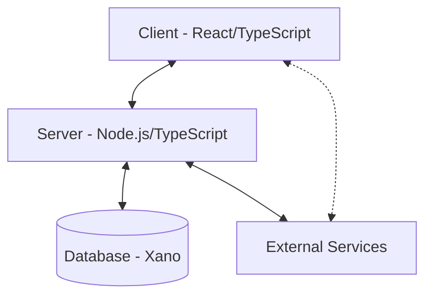
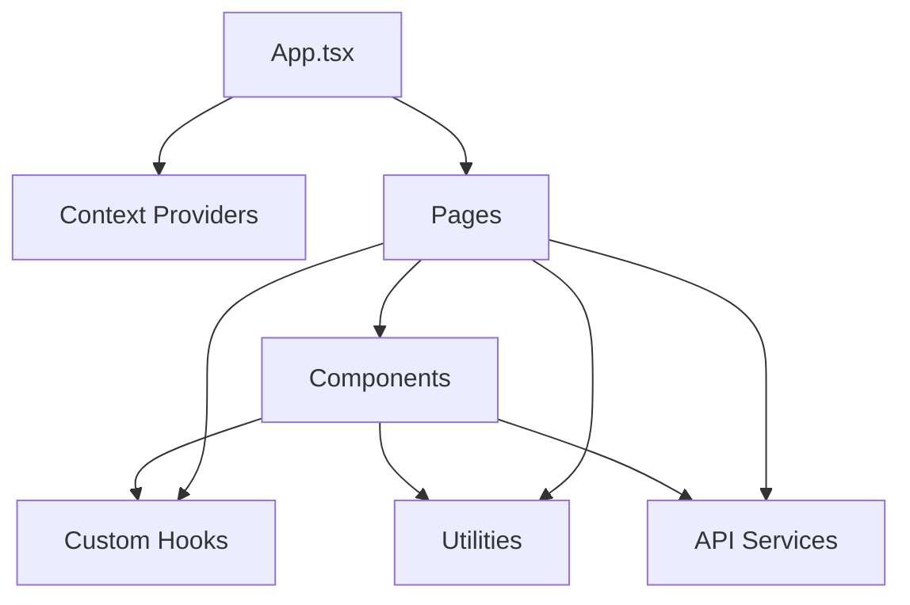
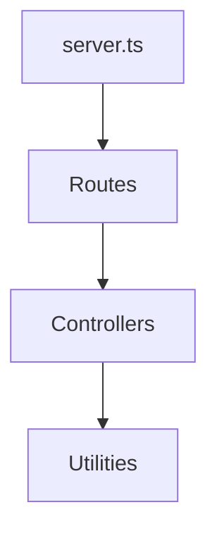
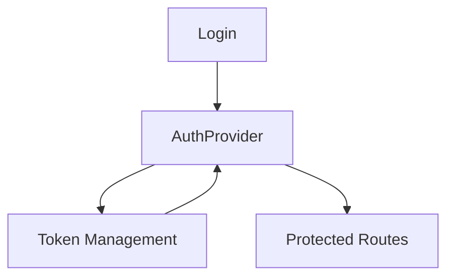

# System Patterns: Calvin EMR

## Architecture Overview

Calvin EMR follows a modern full-stack architecture with clear separation of concerns:

### Client Architecture

The frontend is built with React and TypeScript using a component-based architecture:

### Server Architecture

The backend is built with Node.js and TypeScript, serving as an API gateway and service orchestrator:

## Key Design Patterns

### Frontend Patterns

1. **Context API for State Management**

   - Global state is managed through React Context API
   - Separate contexts for different domains (Auth, User, Clinic, etc.)
   - Providers wrap the application to make state available throughout

2. **Custom Hooks Pattern**

   - Business logic extracted into reusable custom hooks
   - Hooks for common functionality like authentication, form handling, etc.
   - Promotes code reuse and separation of concerns

3. **Component Composition**

   - UI built from composable, reusable components
   - Components organized by domain and responsibility
   - Shared UI components in dedicated directories

4. **Container/Presentational Pattern**

   - Separation between logic and presentation
   - Container components handle data fetching and state
   - Presentational components focus on rendering UI

5. **Render Props and Higher-Order Components**
   - Used for cross-cutting concerns like authentication
   - Enables code reuse for common patterns

### Backend Patterns

1. **Controller-Service Pattern**

   - Controllers handle HTTP requests and responses
   - Services contain business logic
   - Clear separation of concerns

2. **Middleware Pattern**

   - Request processing pipeline with middleware functions
   - Authentication, logging, error handling as middleware

3. **Adapter Pattern**
   - Wrappers around external services (Xano, SRFax, etc.)
   - Provides consistent interface for external dependencies

## Data Flow Patterns

1. **Unidirectional Data Flow**

   - State flows down through component hierarchy
   - Events flow up to modify state
   - Predictable state management

2. **API Data Fetching**

   - Centralized API service modules
   - Consistent error handling and response processing
   - Typed API responses with TypeScript interfaces

3. **Real-time Updates with WebSockets**
   - Socket.io for real-time communication
   - Event-based architecture for real-time features
   - Socket handlers for different event types

## Authentication & Authorization

1. **Token-based Authentication**

   - JWT tokens for authentication
   - Refresh token pattern for session management
   - Secure storage of tokens

2. **Role-based Authorization**
   - Different user roles (Admin, Staff, Patient)
   - Component-level access control
   - Route protection based on user roles

## Error Handling Patterns

1. **Centralized Error Handling**

   - Global error boundaries in React
   - Consistent error response format from API
   - Error logging and monitoring

2. **Graceful Degradation**
   - Fallback UI for error states
   - Offline support for critical functions
   - Retry mechanisms for transient failures

## Performance Patterns

1. **Code Splitting**

   - Route-based code splitting
   - Lazy loading of components
   - Optimized bundle size

2. **Memoization**

   - Caching expensive calculations
   - Preventing unnecessary re-renders
   - Optimized rendering performance

3. **Virtualization**
   - Efficient rendering of large lists
   - Only rendering visible items
   - Smooth scrolling performance

## Security Patterns

1. **Input Validation**

   - Client-side and server-side validation
   - Schema-based validation for forms
   - Protection against injection attacks

2. **Session Management**

   - Auto-logout for inactive sessions
   - Screen locking for privacy
   - Secure session storage

3. **Data Protection**
   - Encryption for sensitive data
   - Principle of least privilege
   - Audit logging for sensitive operations

This document serves as a reference for the architectural patterns and design decisions in the Calvin EMR system. It should be consulted when making changes to ensure consistency with the established patterns.
